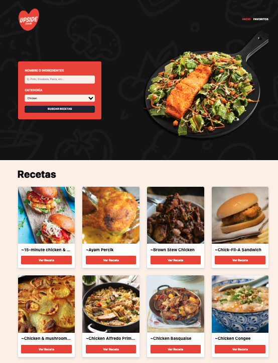

# Recetas App — Buscador y Gestor de Recetas con Vue + Pinia


---

## 📄 Descripción

**Recetas App** es una aplicación desarrollada con **Vue 3** y **Pinia** que permite buscar recetas por nombre o categoría, consultar su información nutricional y visualizarlas en detalle. Integra funcionalidades de favoritos con persistencia en `localStorage`, notificaciones contextuales y un diseño limpio y responsive. Consume la API pública de **TheMealDB**.

---

## 🌐 Demo

🔗 [meals-pinia-api](https://meals-pinia-api-vue-router.vercel.app/)


---

## 🖼️ Capturas

#### Vista principal



---

## ✨ Funcionalidades

- Búsqueda de recetas por nombre y/o categoría
- Visualización detallada de cada receta
- Gestión de favoritos con persistencia en `localStorage`
- Notificaciones automáticas tipo toast
- Modal interactivo con acción condicional (agregar/eliminar favorito)
- Validación de resultados vacíos
- Interfaz moderna y responsive con **Tailwind CSS**

---

## 💻 Tecnologías Utilizadas

- **Vue.js 3**
- **Pinia**
- **Vue Router**
- **Axios**
- **Tailwind CSS**
- **TheMealDB API**

---

## 📋 Requisitos

- Node.js v18 o superior
- Navegador moderno
- Git

---

## 🧱 Estructura del Proyecto

```bash
RecetasApp/
├── src/
│   ├── components/        # Header, Modal, Notificación, Receta
│   ├── views/             # Inicio, Favoritos
│   ├── stores/            # Estados globales: comidas, favoritos, modal, notificaciones
│   ├── services/          # APIServices: lógica de consumo
│   ├── lib/               # Configuración de Axios
│   ├── router/            # Rutas
│   ├── assets/            # Estilos CSS
│   └── main.js / App.vue
├── tailwind.config.js
└── vite.config.js
```
---


## 🛠️ Instalación

```bash
git clone http://github.com/eze-ms/Meals-Pinia-API

```

### Instalar dependencias
```bash
npm install
```

### Iniciar servidor
```bash
npm run dev
```
---

© 2024. Proyecto desarrollado por Ezequiel Macchi Seoane
